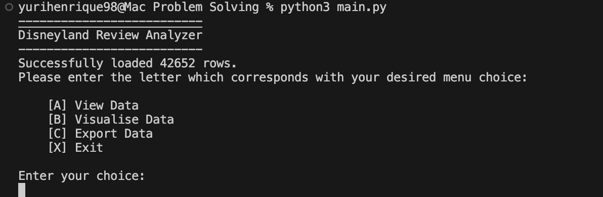
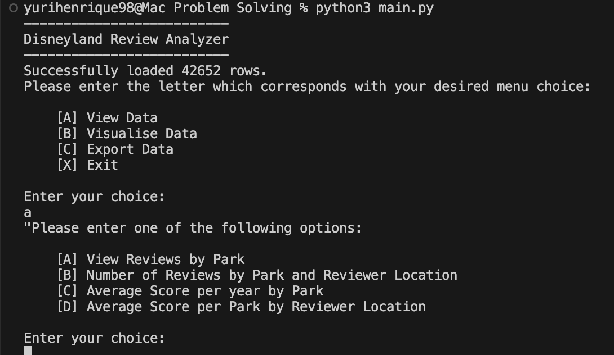
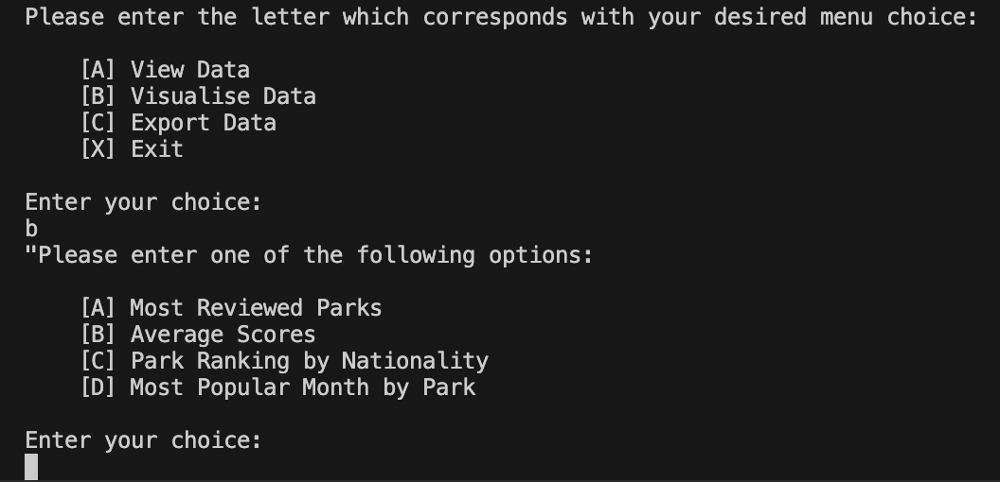
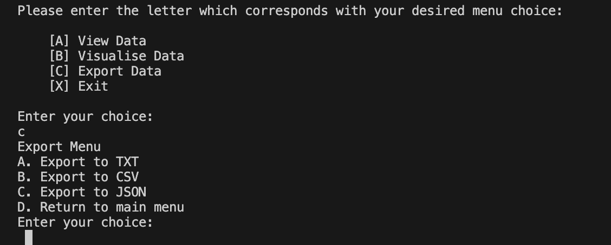

# 📊 Data Analysis Toolkit

<p align="center">
  
</p>

A modular Python application developed to analyse, visualise, and export large datasets through an interactive Terminal User Interface (TUI). The project demonstrates core data processing techniques, statistical analysis, and modular software design using Python.

---

## 📖 Overview

The **Data Analysis Toolkit** was developed as part of a university software engineering module to explore practical data analysis using Python.

Using a dataset containing more than **42,000 Disneyland reviews**, the application enables users to browse review data, perform statistical analysis, generate visualisation options, and export processed information into multiple formats.

The project follows a modular architecture by separating user interaction, data processing, exporting, and visualisation into independent modules.

---

## ✨ Features

- 📂 Load and process datasets containing over **42,000 records**
- 🔍 Interactive Terminal User Interface (TUI)
- 📈 Statistical analysis of review data
- 🌍 Filter reviews by park and reviewer location
- 📊 Data visualisation using Matplotlib
- 📁 Export processed data to TXT, CSV and JSON
- 🧩 Modular Python architecture
- 🖥️ Command-line based interface

---

## 📸 Application Preview

### Main Menu

The application starts by loading the dataset and presenting the user with the available analysis options.

<p align="center">

</p>

---

### Data Analysis

Users can access multiple statistical analysis options, including park reviews, reviewer locations and average scores.

<p align="center">

</p>

---

### Visualisation Menu

The application includes several visualisation options using **Matplotlib**, allowing users to generate charts based on the dataset.

<p align="center">

</p>

---

### Export Menu

Processed data can be exported into multiple formats including **TXT**, **CSV**, and **JSON**.

<p align="center">

</p>

---

## 🏗️ Project Structure

```
Data-Analysis-Toolkit/
│
├── main.py                 # Application entry point
├── process.py              # Data processing and statistics
├── visual.py               # Data visualisation
├── exporter.py             # Export functionality
├── tui.py                  # Terminal User Interface
├── disneyland_reviews.csv  # Dataset
├── images/                 # README assets
└── README.md
```

---

## 🛠️ Technologies Used

| Technology | Purpose |
|------------|---------|
| Python 3 | Core programming language |
| CSV | Dataset processing |
| JSON | Data export |
| Matplotlib | Data visualisation |
| Modular Programming | Separation of concerns |
| Object-Oriented Concepts | Code organisation |

---

## 🚀 Getting Started

### Clone the repository

```bash
git clone https://github.com/yurihenrique98/Data-Analysis-Toolkit.git
cd Data-Analysis-Toolkit
```

### Install dependencies

```bash
pip install matplotlib
```

### Run the application

```bash
python main.py
```

or

```bash
python3 main.py
```

---

## 📊 Dataset

The application uses a public dataset containing over **42,000 Disneyland reviews**, including:

- Review Rating
- Review Date
- Reviewer Location
- Disneyland Branch

Supported parks include:

- Disneyland California
- Disneyland Paris
- Disneyland Hong Kong

---

## 🎯 Learning Outcomes

This project demonstrates knowledge of:

- Python programming
- File handling
- CSV processing
- Data filtering
- Statistical analysis
- Modular software architecture
- Command-line application development
- Data visualisation
- Exporting structured data

---

## 📌 Academic Note

This repository represents one of my early university projects and was developed while learning Python, modular programming, and data analysis techniques.

The project successfully demonstrates the learning objectives of the module, including dataset processing, statistical analysis, modular software architecture, and data exporting. As an academic project, it reflects my progression as a software developer and showcases the foundations that later supported more advanced full-stack applications in my portfolio.

---

## 👨‍💻 Author

**Yuri Henrique Gomes de Oliveira**

Graduate Software Developer

📍 London, United Kingdom

GitHub: https://github.com/yurihenrique98

LinkedIn: https://www.linkedin.com/in/yuri-henrique-gomes-de-oliveira-07a4bb395

---

## 📄 Licence

This project was developed for academic purposes as part of a university assessment.
